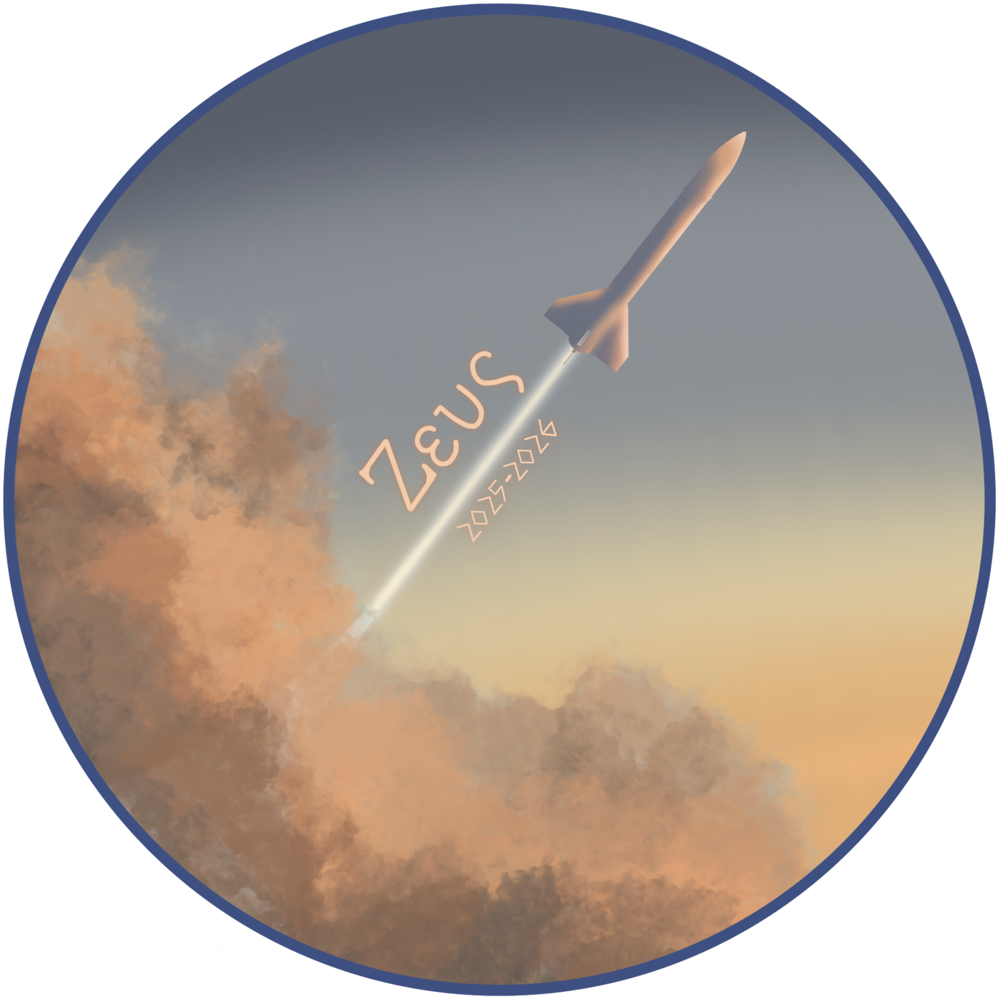

<p align="center">
  <br>
  <a href="#">
    
  </a>
  <br>
</p>

<h1 align="center">PMI - Projet Zeus </h1>

<p align="center">
  Projet réalisé par : Corentin GAUDARD / Charbel Ghanem / Antoine ROUYER / Arthur TOUATI
  <br>
  License : MIT
  <br>
  Version : 1.0
  <br>
</p>

---

## Table des matières

- [Description](#Description-du-projet)
- [Logiciel Requis](#logiciel-requis)
- [Installation](#installation)

## Description du Projet

Le but de ce projet est de fabriquer une fusée expérimentale avec deux mission principales : 

**Analyse météo :**
Nous alons mesurer des données météorologiques grâce a un larguage de charge utile de type cansat à une altitude d’environ 3km, afin de faire une étude des nuages en moyennes altitude.
Pour cela nous utilisons de nombreux capteurs tel qu'un BME680, un anémometre à ultrason, un pyranometre, un gps et un imu.
 
**Prédiction et analyse de trajectoire en temp réel :**
Nous dévelopons un réseau de neurone afin de de prédire la trajectoire de notre fusée en fonction de different parametre (le poid, la position au décollage, les conditions météo sol au décollage) et nous allons analyser en temp réel la variation entre notre trajectoire et la prédiction de celle ci.

Pour cela, la fusée va etre séparé en different module : 

**Module télémesure :** 
Ce module comporte la liaison sol de notre fusée (une télémesure numérique) afin d'envoyer les données de vol à une station sol.

**Module larguage-charge utile :**
Ce module comporte le systeme de larguage de notre charge utile ainsi que la charge utile elle même.

**Module data :**
Ce module comporte le "cerveau" de notre fusée avec le modele de machine learning, la sauvegarde des données et le controle des autres modules.

**Module poussée :**
Ce module comporte les supports de notre propulseur.

## Logiciel requis

- [Arduino IDE](https://www.arduino.cc/en/software)
- [Pychram (ou equivalent)](https://www.jetbrains.com/pycharm/)

## Installation

Décrivez les étapes nécessaires pour installer et préparer l'environnement pour ce projet.

1. **Téléchargez et installez l'Arduino IDE** depuis le site officiel.
2. **Clonez ce dépôt**.
   ```bash
   git clone [https://github.com/NFXSTUDIO/Projet_Zeus_2025-2026](https://github.com/NFXSTUDIO/Projet_Zeus_2025-2026)
   cd [Nom du dossier du projet]
